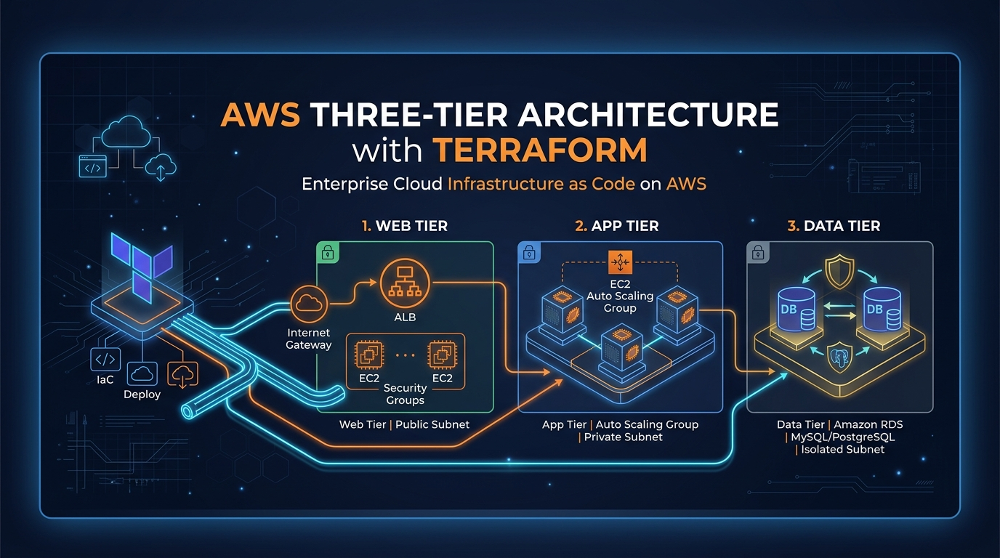
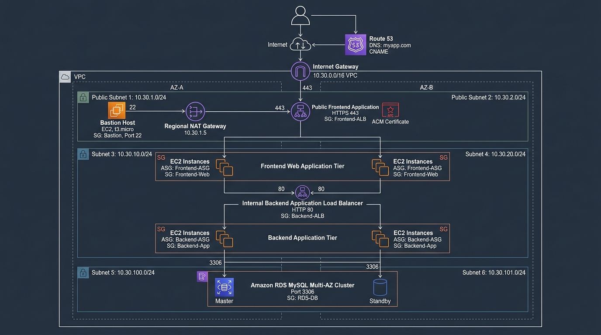
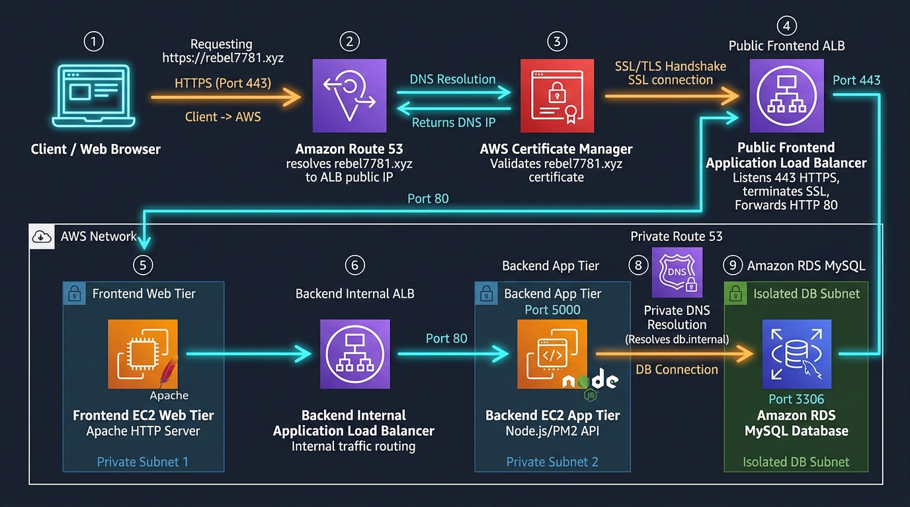
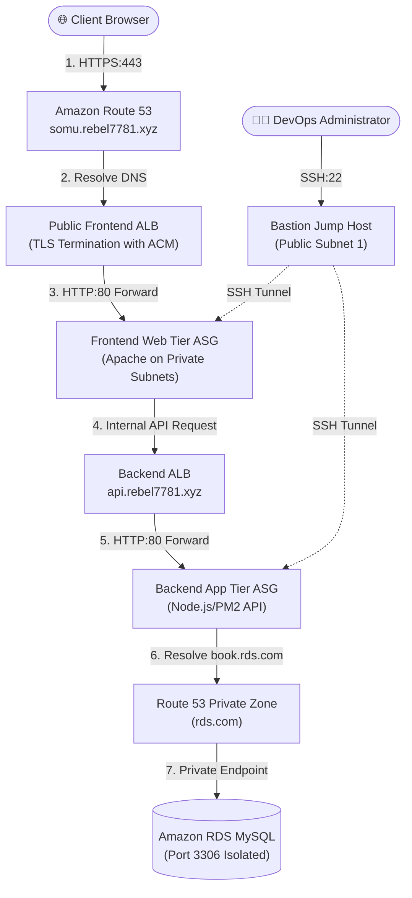
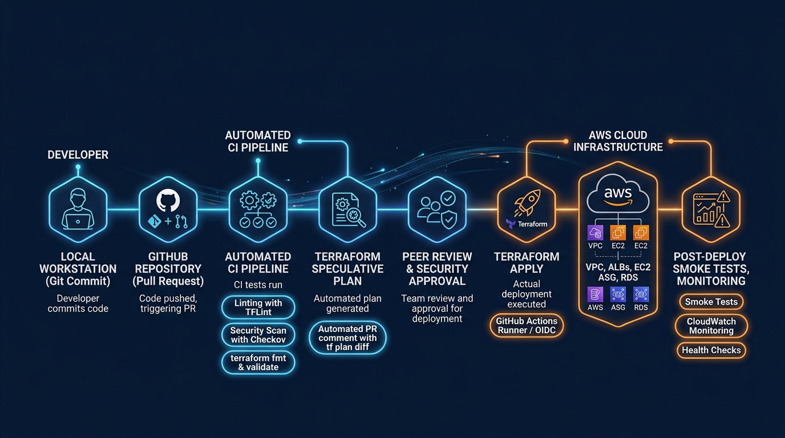

<p align="center">
  
</p>

<h1 align="center">AWS Three-Tier Web Application Infrastructure with Terraform</h1>

<p align="center">
  <strong>An enterprise-grade, highly available, multi-AZ cloud architecture provisioned with modular Terraform on Amazon Web Services.</strong>
</p>

<p align="center">
  
  
  
  
  
</p>

---

## 📌 Executive Summary

This repository contains the complete **Infrastructure as Code (IaC)** implementation for an enterprise-ready, three-tier cloud web application deployed into **Amazon Web Services (AWS)** using **HashiCorp Terraform**.

The architecture decouples the presentation, business logic, and database persistence layers into dedicated network subnets across two Availability Zones (`us-east-1a` and `us-east-1b`), ensuring high availability, zero public exposure of database systems, automated certificate management, and elastic compute scaling.

---

## 🛠️ Technology Stack

| Domain | Technology / Service | Role in Architecture |
| :--- | :--- | :--- |
| **Infrastructure as Code** | **HashiCorp Terraform (`>= 1.5.0`)** | Modular resource declaration, dependency graphs, and state management |
| **Cloud Platform** | **Amazon Web Services (AWS)** | Enterprise cloud hosting provider |
| **Network Foundation** | **AWS VPC, IGW, NAT Gateway** | Isolated software-defined network, multi-AZ subnets, and outbound routing |
| **Application Delivery** | **Dual Application Load Balancers** | Edge SSL termination, path routing, and target health checking |
| **Domain & Certificates** | **Amazon Route 53 & ACM** | Public DNS alias records, private service discovery, and automated SSL/TLS |
| **Compute & Scaling** | **Amazon EC2 & Auto Scaling** | Launch Templates with cloud-init bootstrapping across availability zones |
| **Data Persistence** | **Amazon RDS (MySQL)** | Managed database in private isolated subnets with gp3 storage |
| **Perimeter Security** | **Bastion Host Jump Server** | Secure SSH tunneling for remote administrative access |
| **Quality & CI/CD** | **GitHub Actions, TFLint, Checkov** | Automated linting, speculative planning, and security policy checks |

---

## 🏛️ System Architecture

The environment spans a custom Virtual Private Cloud (VPC) with CIDR `10.30.0.0/16`, segmented into 2 public subnets and 6 private subnets.

<p align="center">
  
</p>

### Network Subnet Segmentation

| Tier | Subnet Name | CIDR Block | Availability Zone | Routing Gateway | Public IP Assigned? |
| :--- | :--- | :--- | :--- | :--- | :--- |
| **Edge / Ingress** | `public_subnet_1` | `10.30.1.0/24` | `us-east-1a` | Internet Gateway (IGW) | Yes (ALB & Bastion) |
| **Edge / Ingress** | `public_subnet_2` | `10.30.2.0/24` | `us-east-1b` | Internet Gateway (IGW) | Yes (ALB) |
| **Presentation (Web)** | `private_subnet_3` | `10.30.3.0/24` | `us-east-1a` | Regional NAT Gateway | No (Private Only) |
| **Presentation (Web)** | `private_subnet_4` | `10.30.4.0/24` | `us-east-1b` | Regional NAT Gateway | No (Private Only) |
| **Application (API)** | `private_subnet_5` | `10.30.5.0/24` | `us-east-1a` | Regional NAT Gateway | No (Private Only) |
| **Application (API)** | `private_subnet_6` | `10.30.6.0/24` | `us-east-1b` | Regional NAT Gateway | No (Private Only) |
| **Database (Data)** | `private_subnet_7` | `10.30.7.0/24` | `us-east-1a` | Internal only | No (Isolated) |
| **Database (Data)** | `private_subnet_8` | `10.30.8.0/24` | `us-east-1b` | Internal only | No (Isolated) |

---

## 🔄 End-to-End Request Flow

Traffic traverses through secure boundaries with SSL termination at the edge, private application processing in the middle tier, and internal DNS resolution for data persistence.

<p align="center">
  
</p>



---

## 🚀 CI/CD & Deployment Pipeline

This repository includes a production-ready GitHub Actions workflow (`.github/workflows/terraform.yml`) enforcing static analysis, security scans, and speculative plan reviews before applying changes.

<p align="center">
  
</p>

---

## 🛡️ Security Architecture & Risk Analysis

Security in depth is enforced across network zones, instance configurations, and administrative boundaries.

<p align="center">
  
</p>

### Senior Engineering Review Findings & Remediation Plan

| Risk Identifier | Current Configuration | Severity | Target Architecture Remediation |
| :--- | :--- | :--- | :--- |
| **Over-Permissive SG** | Single SG permits `0.0.0.0/0` across all protocols | **CRITICAL** | Segment into 4 distinct security groups (Public ALB, Web Tier, App Tier, RDS). |
| **Plain-Text Credentials** | RDS password hardcoded in Terraform and bootstrap script | **HIGH** | Integrate **AWS Secrets Manager** with IAM role-based retrieval. |
| **Backend ALB Exposure** | Backend ALB is public in `public_subnets` | **HIGH** | Set `internal = true` and place into private application subnets. |
| **HTTP Listener Redirection** | HTTP listener (port 80) forwards directly | **MEDIUM** | Configure HTTP-to-HTTPS 301 redirection on port 80. |
| **ASG Sizing Limits** | ASG configured with `min=1, max=1, desired=1` | **MEDIUM** | Configure elastic capacity (`min=2, max=4, desired=2`) across AZs. |
| **Missing IAM Profiles** | EC2 instances launched without IAM instance profile | **MEDIUM** | Attach IAM role with AWS SSM and CloudWatch logging policies. |

*Detailed remediation blueprints and code examples are documented in [docs/SECURITY.md](docs/SECURITY.md).*

---

## 📂 Repository Structure

```text
.
├── .github/
│   ├── ISSUE_TEMPLATE/
│   │   ├── bug_report.md             # Issue template for infrastructure defects
│   │   └── feature_request.md        # Issue template for architecture enhancements
│   ├── workflows/
│   │   └── terraform.yml             # GitHub Actions CI/CD automation pipeline
│   └── PULL_REQUEST_TEMPLATE.md      # Pull request review and blast-radius template
├── assets/
│   ├── architecture_diagram.png      # AWS Three-Tier Architecture visual
│   ├── deployment_workflow.png       # CI/CD deployment pipeline graphic
│   ├── repo_banner.png               # Project GitHub banner
│   ├── request_flow.png              # Multi-tier request flow diagram
│   └── security_architecture.png     # Defense-in-depth security infographic
├── docs/
│   ├── ARCHITECTURE.md               # Deep-dive architecture and component breakdown
│   ├── COST_ESTIMATION.md            # Realistic AWS cost models and FinOps optimizations
│   ├── DEPLOYMENT.md                 # Step-by-step provisioning and runbooks
│   ├── PROJECT_OVERVIEW.md           # Business use case and design decisions
│   ├── SECURITY.md                   # Threat model, risk matrix, and security hardening
│   └── TROUBLESHOOTING.md            # Root cause analyses and common error resolutions
├── module/
│   ├── RDS/                          # Amazon RDS MySQL instance & subnet group module
│   ├── acm/                          # AWS Certificate Manager & automated DNS validation
│   ├── autoscaling_grouping/         # Auto Scaling Group capacity module
│   ├── bastion_host/                 # Administrative jump server module
│   ├── lanuch_template/              # EC2 Launch Templates & bootstrap shell scripts
│   ├── loadbalancer/                 # Application Load Balancers, target groups & listeners
│   ├── route53/                      # Public & private Route 53 DNS records
│   ├── security_group/               # AWS Security Groups module
│   └── vpc/                          # VPC, subnets, IGW, NAT Gateway, route tables
├── .gitignore                        # Git exclusion rules for tfstate, keys, and credentials
├── .tflint.hcl                       # TFLint configuration for AWS ruleset
├── CHANGELOG.md                      # Semantic versioning release log
├── CONTRIBUTING.md                   # Engineering standards and PR contribution guide
├── LICENSE                           # Open-source MIT License
├── main.tf                           # Root Terraform configuration orchestrating modules
└── terraform.tfvars.example          # Environment variable template (no secrets)
```

---

## ⚡ Quickstart & Deployment

### Prerequisites
- [Terraform](https://developer.hashicorp.com/terraform/downloads) `>= 1.5.0`
- [AWS CLI v2](https://docs.aws.amazon.com/cli/latest/userguide/getting-started-install.html) configured with administrative credentials
- A registered domain with an active Amazon Route 53 Public Hosted Zone (e.g. `rebel7781.xyz`)
- An existing EC2 Key Pair (e.g. `ansible`) in region `us-east-1`

### 1. Clone & Configure
```bash
git clone https://github.com/your-username/aws-three-tier-terraform.git
cd aws-three-tier-terraform

# Copy variable configuration template
cp terraform.tfvars.example terraform.tfvars
```
*Edit `terraform.tfvars` with your domain name, AMI IDs, and AWS key pair.*

### 2. Initialize & Validate
```bash
# Initialize Terraform provider plugins and local modules
terraform init

# Check canonical formatting
terraform fmt -check

# Validate configuration syntax and module declarations
terraform validate
```

### 3. Plan & Deploy
```bash
# Generate speculative execution plan
terraform plan -out=tfplan

# Apply the infrastructure changes to AWS
terraform apply tfplan
```

### 4. Post-Deployment Verification
```bash
# View all generated DNS endpoints and resource IDs
terraform output

# Test public HTTPS response
curl -Iv https://somu.rebel7781.xyz
```

---

## 💰 Cost Model & FinOps Summary

| Resource Type | SKU / Capacity | Estimated Monthly Cost |
| :--- | :--- | :--- |
| Regional NAT Gateway | 1 Regional NAT Gateway + Data Egress | ~\$34.65 |
| Application Load Balancers | 2 ALBs (Frontend + Backend) + LCUs | ~\$38.20 |
| EC2 Compute Instances | 2 x `t3.medium` (Web & App tiers) | ~\$63.10 |
| Bastion Host | 1 x `t3.micro` | ~\$8.13 |
| Amazon RDS Database | 1 x `db.t3.micro` (Single-AZ, 30 GB gp3) | ~\$15.69 |
| Route 53 & ACM | 2 Hosted Zones + Public SSL Certificate | ~\$1.00 |
| **Total Estimated Baseline** | *(us-east-1 On-Demand pricing)* | **~\$160.77 / month** |

*For complete FinOps recommendations and cost-cutting strategies, see [docs/COST_ESTIMATION.md](docs/COST_ESTIMATION.md).*

---

## 🧹 Teardown & Resource Destruction

To avoid recurring AWS infrastructure charges when testing is complete:

```bash
terraform destroy -auto-approve
```

---

## 📄 License & Attribution

This project is licensed under the terms of the [MIT License](LICENSE).  
Created and maintained by **Someswara Rao Tarra**.
