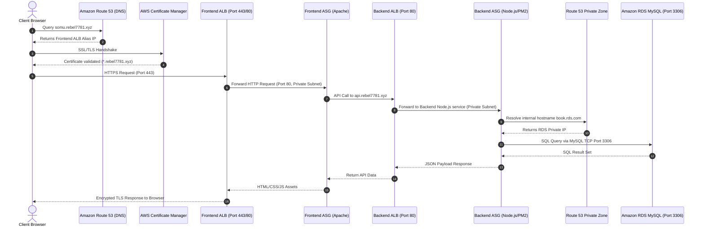

# Architecture Deep Dive: AWS Three-Tier Web Infrastructure

---

## 1. High-Level Architecture Overview

The system implements a classic **Three-Tier Architecture** on Amazon Web Services (AWS), dividing presentation, business application processing, and data persistence into decoupled, secured layers.


---

## 2. Network Topology & Subnet Design

The network is anchored in a Virtual Private Cloud (VPC) with CIDR block `10.30.0.0/16` across two Availability Zones (`us-east-1a` and `us-east-1b`).

### Subnet Allocation Matrix

| Subnet Identifier | CIDR Block | Availability Zone | Tier Classification | Route Table Association | Internet Access Mode |
| :--- | :--- | :--- | :--- | :--- | :--- |
| `public_subnet_1` | `10.30.1.0/24` | `us-east-1a` | Perimeter / Edge | `3-TIER-PUBLIC-ROUTE` | Direct via Internet Gateway (IGW) |
| `public_subnet_2` | `10.30.2.0/24` | `us-east-1b` | Perimeter / Edge | `3-TIER-PUBLIC-ROUTE` | Direct via Internet Gateway (IGW) |
| `private_subnet_3` | `10.30.3.0/24` | `us-east-1a` | Presentation / Web | `3-TIER-PRIVATE-ROUTE` | Outbound only via NAT Gateway |
| `private_subnet_4` | `10.30.4.0/24` | `us-east-1b` | Presentation / Web | `3-TIER-PRIVATE-ROUTE` | Outbound only via NAT Gateway |
| `private_subnet_5` | `10.30.5.0/24` | `us-east-1a` | Application / API | `3-TIER-PRIVATE-ROUTE` | Outbound only via NAT Gateway |
| `private_subnet_6` | `10.30.6.0/24` | `us-east-1b` | Application / API | `3-TIER-PRIVATE-ROUTE` | Outbound only via NAT Gateway |
| `private_subnet_7` | `10.30.7.0/24` | `us-east-1a` | Database / RDS | `3-TIER-PRIVATE-ROUTE` | Isolated (No inbound from internet) |
| `private_subnet_8` | `10.30.8.0/24` | `us-east-1b` | Database / RDS | `3-TIER-PRIVATE-ROUTE` | Isolated (No inbound from internet) |

### Routing Infrastructure

1. **Public Route Table (`3-TIER-PUBLIC-ROUTE`):**
   - Route `10.30.0.0/16` -> `local`
   - Route `0.0.0.0/0` -> `aws_internet_gateway.vpc_igw`
   - Associated with `public_subnet_1` and `public_subnet_2`.
2. **Private Route Table (`3-TIER-PRIVATE-ROUTE`):**
   - Route `10.30.0.0/16` -> `local`
   - Route `0.0.0.0/0` -> `aws_nat_gateway.nat_gate` (Regional NAT Gateway)
   - Associated with all six private subnets (`private_subnet_3` through `private_subnet_8`).

---

## 3. End-to-End Request Flow & Communication Paths




---

## 4. Component Breakdown & Resource Configurations

### A. Load Balancing Tier
- **Frontend ALB (`frontend-lb`):**
  - Type: Application Load Balancer
  - Scheme: Internet-facing (`internal = false`)
  - Subnets: Multi-AZ across `public_subnet_1` and `public_subnet_2`
  - Listeners:
    - Port 80 (HTTP) forwarding to `frontend-tg`
    - Port 443 (HTTPS) terminating TLS with ACM Certificate ARN
- **Backend ALB (`backend-lb`):**
  - Type: Application Load Balancer
  - Current Scheme: Declared with `internal = false` in public subnets (Target design: `internal = true` in private subnets)
  - Listeners: Port 80 (HTTP) and Port 443 (HTTPS) forwarding to `backend-tg`

### B. Compute Tier (Launch Templates & ASG)
- **Frontend Compute:**
  - Launch Template: `frontend-launch-template`
  - Instance Type: `t3.medium`
  - AMI: `ami-0b43b979fd80c51bb` (Ubuntu 22.04 LTS)
  - Bootstrap: `frontend.sh` installs and starts `apache2`.
  - Network: Placed in private subnets `10.30.3.0/24` and `10.30.4.0/24`. `associate_public_ip_address = false`.
- **Backend Compute:**
  - Launch Template: `backend-launch-template`
  - Instance Type: `t3.medium`
  - AMI: `ami-0580db2002f7edccb`
  - Bootstrap: `backend.sh` initializes PM2 service and runs database seed scripts (`index.js`).
  - Network: Placed in private subnets `10.30.5.0/24` and `10.30.6.0/24`. `associate_public_ip_address = false`.
- **Auto Scaling Configuration:**
  - `min_size = 1`, `max_size = 1`, `desired_capacity = 1` for each tier.
  - Integration: Directly attached to ALB target group ARNs.

### C. Database Tier (Amazon RDS MySQL)
- **Engine:** MySQL Community Edition
- **Instance Class:** `db.t3.micro`
- **Storage:** 30 GB General Purpose SSD (`gp3`)
- **Networking:** `aws_db_subnet_group` spanning `private_subnet_7` (`10.30.7.0/24`) and `private_subnet_8` (`10.30.8.0/24`).
- **Security:** `publicly_accessible = false`, non-routable from the public internet.

### D. DNS & Certificate Management
- **Public Domain Resolution:**
  - Route 53 Alias `A` record `somu.rebel7781.xyz` -> Frontend ALB.
  - Route 53 Alias `A` record `api.rebel7781.xyz` -> Backend ALB.
- **Automated ACM Validation:**
  - Request certificate for `rebel7781.xyz` with wildcard SAN `*.rebel7781.xyz`.
  - Automatically provisions DNS validation CNAME records in Route 53.
  - Resolves certificate lifecycle dependencies cleanly using `aws_acm_certificate_validation`.
- **Private Database DNS:**
  - Route 53 Private Hosted Zone: `rds.com` associated with VPC `network.id`.
  - CNAME Record: `book.rds.com` -> RDS Instance Address hostname.

### E. Perimeter Administration (Bastion Host)
- Deployed as an EC2 instance in `public_subnet_1`.
- Provides secure jump access via SSH key (`ansible`).
- Allows operations teams to tunnel into private web and application instances using SSH Agent Forwarding:
  ```bash
  ssh -A -i ~/.ssh/ansible.pem ubuntu@<BASTION_PUBLIC_IP>
  ssh ubuntu@<PRIVATE_WEB_OR_APP_IP>
  ```
