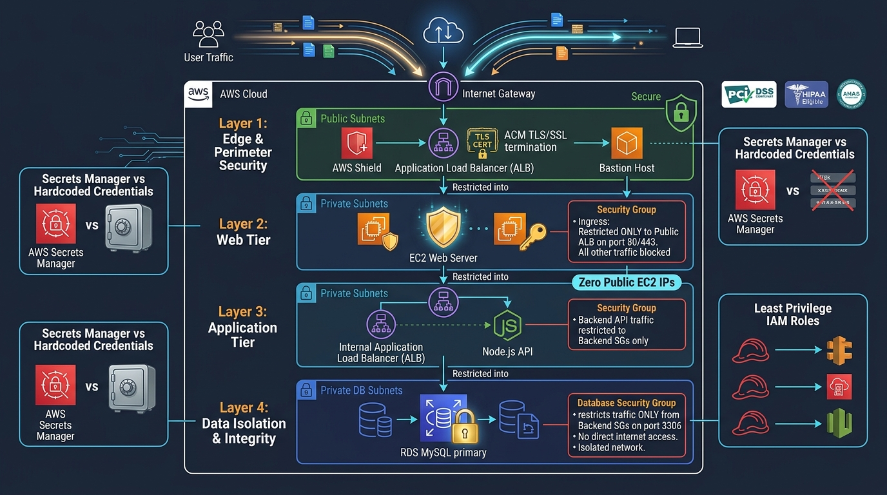
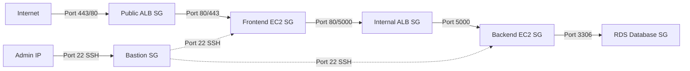

# Security Architecture & Risk Assessment

---

## 1. Security Overview

Security is a foundational pillar of enterprise cloud engineering. This document provides a transparent, rigorous security analysis of the current infrastructure codebase, identifying vulnerabilities, current security controls, and production remediation plans.



---

## 2. Risk Assessment & Findings Matrix

The following table summarizes findings discovered during the senior engineering review of the current Terraform configuration:

| Risk ID | Vulnerability Description | Severity | Current Code State | Enterprise Remediation Plan |
| :--- | :--- | :--- | :--- | :--- |
| **SEC-01** | **Monolithic Over-Permissive Security Group** | **CRITICAL** | Single SG allows all protocols (`-1`) from `0.0.0.0/0` across all tiers | Replace with 4 decoupled, least-privilege Security Groups |
| **SEC-02** | **Hardcoded Plain-Text Database Password** | **HIGH** | Plaintext password declared in `main.tf` and `backend.sh` | Store in AWS Secrets Manager; inject dynamically |
| **SEC-03** | **Public Exposure of Backend Application Load Balancer** | **HIGH** | `internal = false` placed in public subnets | Change to `internal = true` inside private subnets |
| **SEC-04** | **Unencrypted HTTP Listener without HTTPS Redirection** | **MEDIUM** | Port 80 listener forwards directly to target group | Update listener default action to redirect 80 -> 443 |
| **SEC-05** | **Bastion Host Unrestricted Ingress** | **MEDIUM** | SSH port 22 open to `0.0.0.0/0` | Restrict to corporate CIDR or migrate to AWS SSM Session Manager |
| **SEC-06** | **Missing IAM Instance Profiles for EC2 Instances** | **MEDIUM** | EC2 instances launch with no attached IAM role | Attach IAM role with AWS SSM and CloudWatch Agent policies |
| **SEC-07** | **RDS Storage Encryption Not Explicitly Enforced** | **LOW** | `storage_encrypted = true` not declared on RDS instance | Enable KMS storage encryption on RDS and EBS volumes |

---

## 3. Deep-Dive Remediation Guides

### SEC-01: Decoupling Security Groups to Enforce Least Privilege

Currently, all resources share one security group:
```hcl
# CURRENT VULNERABLE CONFIGURATION
module "security_group" {
  ingress_protocol    = "-1"
  ingress_cidr_blocks = ["0.0.0.0/0"] # Permits ALL inbound traffic
}
```

#### Recommended Target Architecture: Four Decoupled Security Groups



```hcl
# 1. Public Frontend ALB Security Group
resource "aws_security_group" "alb_public" {
  name        = "frontend-alb-sg"
  vpc_id      = module.network.vpc_id

  ingress {
    description = "Allow HTTPS from anywhere"
    from_port   = 443
    to_port     = 443
    protocol    = "tcp"
    cidr_blocks = ["0.0.0.0/0"]
  }

  ingress {
    description = "Allow HTTP for redirect"
    from_port   = 80
    to_port     = 80
    protocol    = "tcp"
    cidr_blocks = ["0.0.0.0/0"]
  }

  egress {
    from_port   = 0
    to_port     = 0
    protocol    = "-1"
    cidr_blocks = ["0.0.0.0/0"]
  }
}

# 2. Frontend Web EC2 Security Group
resource "aws_security_group" "web_ec2" {
  name        = "web-tier-sg"
  vpc_id      = module.network.vpc_id

  ingress {
    description     = "Allow HTTP only from Frontend ALB"
    from_port       = 80
    to_port         = 80
    protocol        = "tcp"
    security_groups = [aws_security_group.alb_public.id]
  }

  ingress {
    description     = "SSH from Bastion Host only"
    from_port       = 22
    to_port         = 22
    protocol        = "tcp"
    security_groups = [aws_security_group.bastion.id]
  }

  egress {
    from_port   = 0
    to_port     = 0
    protocol    = "-1"
    cidr_blocks = ["0.0.0.0/0"]
  }
}

# 3. Backend App EC2 Security Group
resource "aws_security_group" "app_ec2" {
  name        = "app-tier-sg"
  vpc_id      = module.network.vpc_id

  ingress {
    description     = "Allow API traffic from Web Tier"
    from_port       = 5000
    to_port         = 5000
    protocol        = "tcp"
    security_groups = [aws_security_group.web_ec2.id]
  }

  ingress {
    description     = "SSH from Bastion Host only"
    from_port       = 22
    to_port         = 22
    protocol        = "tcp"
    security_groups = [aws_security_group.bastion.id]
  }

  egress {
    from_port   = 0
    to_port     = 0
    protocol    = "-1"
    cidr_blocks = ["0.0.0.0/0"]
  }
}

# 4. Database Security Group
resource "aws_security_group" "database" {
  name        = "database-tier-sg"
  vpc_id      = module.network.vpc_id

  ingress {
    description     = "MySQL port 3306 restricted ONLY to App Tier"
    from_port       = 3306
    to_port         = 3306
    protocol        = "tcp"
    security_groups = [aws_security_group.app_ec2.id]
  }

  egress {
    from_port   = 0
    to_port     = 0
    protocol    = "-1"
    cidr_blocks = ["0.0.0.0/0"]
  }
}
```

---

### SEC-02: Secrets Management via AWS Secrets Manager

To eliminate hardcoded credentials:

1. **Provision AWS Secrets Manager Secret:**
   ```hcl
   resource "random_password" "db_password" {
     length           = 16
     special          = true
     override_special = "!#$%&*()-_=+[]{}<>:?"
   }

   resource "aws_secretsmanager_secret" "db_credentials" {
     name                    = "bookstore/database/credentials"
     recovery_window_in_days = 0
   }

   resource "aws_secretsmanager_secret_version" "db_credentials_val" {
     secret_id     = aws_secretsmanager_secret.db_credentials.id
     secret_string = jsonencode({
       username = "admin"
       password = random_password.db_password.result
     })
   }
   ```
2. **Fetch credentials at runtime in EC2 user data:**
   ```bash
   # Retrieve database secret using AWS CLI with instance IAM role
   SECRET_JSON=$(aws secretsmanager get-secret-value --secret-id bookstore/database/credentials --region us-east-1 --query SecretString --output text)
   DB_PASS=$(echo $SECRET_JSON | jq -r .password)
   mysql -h book.rds.com -u admin -p"$DB_PASS" test < test.sql
   ```

---

### SEC-03: Converting Backend ALB to Internal Scheme

In `module/loadbalancer/main.tf`, update the backend ALB declaration:
```hcl
resource "aws_lb" "backend_lb" {
  name               = var.backend_lb_name
  load_balancer_type = "application"
  internal           = true # Prevents exposure on the public internet
  security_groups    = [aws_security_group.app_ec2.id]
  subnets            = [module.network.private_subnets[2], module.network.private_subnets[3]]
}
```

---

### SEC-04: Enforcing HTTP-to-HTTPS Redirection on ALB Listeners

Replace the port 80 forward listener with an HTTP redirect:
```hcl
resource "aws_lb_listener" "frontend_http_redirect" {
  load_balancer_arn = aws_lb.frontend_lb.arn
  port              = 80
  protocol          = "HTTP"

  default_action {
    type = "redirect"
    redirect {
      port        = "443"
      protocol    = "HTTPS"
      status_code = "HTTP_301"
    }
  }
}
```

---

### SEC-05: Eliminating Bastion Ingress with AWS Systems Manager (SSM)

By attaching the AWS-managed policy `AmazonSSMManagedInstanceCore` to an EC2 instance profile, administrators can establish secure browser/CLI shell sessions without opening port 22 to the public internet:
```bash
aws ssm start-session --target <INSTANCE_ID>
```
This entirely eliminates the need for an internet-exposed Bastion host.
